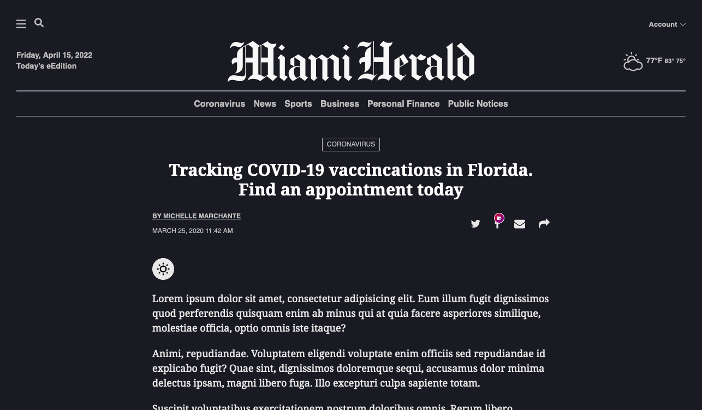
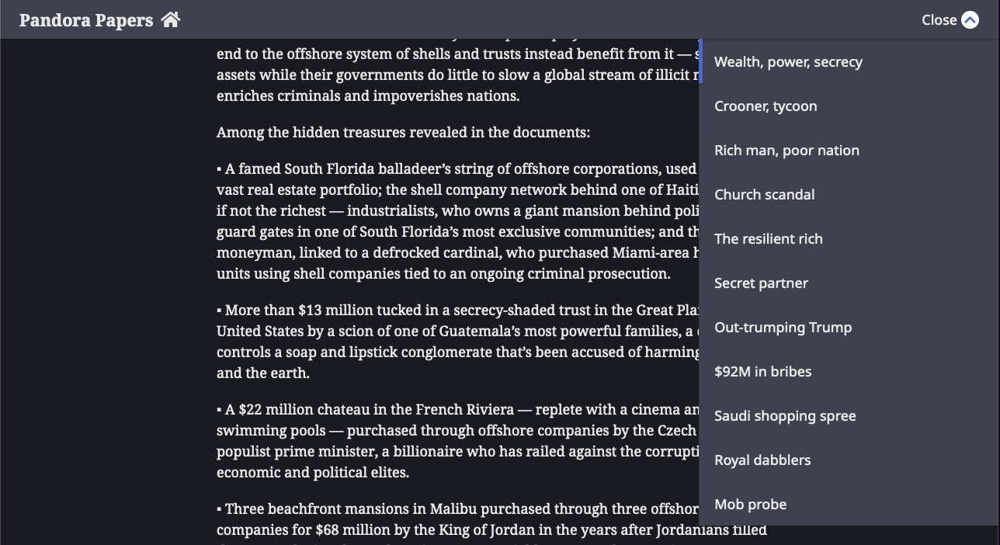

# McClatchy Custom Embed Generator

Basic static site builder for use in developering McClatchy High-Impact projects.

Built with [Vite.js](https://vitejs.dev/).

**Includes**

- `svelte`
- `PostCSS`
- `eslint`
- `handlebars.js`

## Install

You can clone this repo as usual, or use [`create-clone`](https://github.com/rdmurphy/create-clone).

```sh
yarn create clone aaronalbright/mccustom-starter <newProjectName>
# or
npm init clone aaronalbright/mccustom-starter <newProjectName>
```

### To start a server at `localhost:3000`
```sh
npm run dev
```

The server is started from `./index.html` which is fed via a handlebars partial at `./partials/base.html`. From there, `./partials/embed.html` is the *actual* HTML snippet that will be put into CUE as an embed. The rest is just boilerplate for local development.

This can be configured in `vite.config.js` under the `handlebars()` plugin.

`miCss` is used to fetch an always up-to-date version of the main McClatchy WPS site CSS.

### Build a static embed

Puts files into `dist/`. Make sure you update the `name` in `package.json` to ensure the base URL is updated.

```sh
npm run build
```

## Deployment

There's two ways to deploy your static files for the HTML embed.
1. The McClatchy static media server (`media.mcclatchy.com/static/**`)
2. The NewsX GCP bucket (`www.miamiherald.com/static/hi/**`)

Ideally, Option 1 will no longer be needed and everything can be deployed via the `gcloud` CLI via `gsutil`.

### Comannds
```sh
# You must have ~/.ssh/config set up for the static server to use any of the deploy: scripts

# Sets the directory to /[year]/[projectName] as defined by package.json config.projectName
npm run deploy:static

# Same as above but will then update the CUE embed with './dist/partials/embed.html' and republish
# It will NOT republish the story file, only the HTML embed
npm run deploy:cue

# If you just want to update the CUE embed but not deploy new files to the static server
npm run cue

# Uploads files in './dist' to the gcp bucket using the same /[year]/[project-name]/ structure according to the current directory
make bucket

# same as `make bucket` but doesn't push the files, only shows what files will change / be uploaded
make test-bucket

# Copys contents of './dist/partials/embed.html' to the clipboard for a easy paste into CUE
make embed
```

### About CUE deployment and `./utils/update-cue.js`

This is a convenience function that runs on `npm run cue` or `npm run deploy:cue`. You **must** be connected to the McClatchy VPN for this to work. You'll also need a `.env` file in your project root with `CUE_USER` and `CUE_PASS` set accordingly. Additionally, in `package.json`, you'll need to ensure `config.cueID` matches the Content ID of the CUE Embed (not the story the embed is attatched to).


## Extras

Included in this template are two plug-and-play components.

### **`<ThemeToggle>`**

This component allows for a "dark mode" on story pages. Including it will default the page to dark mode and insert a toggle button toward the top of the page near the byline. You will need the svg files found in `./assets/` to take advantage of the button.

The `./src/css/main.css` file contains the property overrides and settings when `.dark` is added to the document body. However, if you want to fully encapuslate everything inside the component, you can also put those styles in `:global(body.dark)` in the Svelte file and accomplish the same thing.

Usage:
```js
<script>
    import ThemeToggle from "./ThemeToggle.svelte";
</script>

<ThemeToggle/>

<h3>Lorem ipsum dolor sit amet consectetur</h3>

<p class="summary">Lorem ipsum dolor sit amet consectetur adipisicing elit. Quo dolore consequatur dolor. Fuga accusamus, voluptatum nesciunt et blanditiis corrupti id quos animi sit! Incidunt temporibus voluptate dicta. Aliquid, corrupti recusandae.</p>
```
**Dark Mode preivew with `<ThemeToggle>`**


=====

### **`<FuseNav>`**

This is an enhancment component that adds an animated "stikcy" navigation to story pages that have a CUE-configured **Series Nav**. If there is no Series Nav embeded on the page this component will do nothing. You can fetch an HTML snippet of Series Nav from a live page and drop it into the `.story-body` in `./partials/base.html` to test the componnent.

**`<FuseNav>` preivew with `<ThemeToggle>` dark mode enabled and custom home button**




## Using enhancments

If you have access to the McClatchy ProdX `gcp-bucket` repository, you can clone it and include any enhencments found at `https://www.miamiherald.com/static/hi/themes/enhancements.js` by adding the path to the local repo to `resolve.alias` in `vite.config.js`. You can also just use the absolute URL.

## Fetching external data

### v2
As of 2021, we have a new method of using data or documents from Google Drive.
By taking advantage of Google Apps Script, you can "publish" content from a Sheet or Document to a McClatchy domain at `www.[domain].com/static/hi/`.

You'll find the documentation for this implementation at [McClatchy/ProdX](https://github.com/mcclatchy/ProdX). It's a private repo so you'll need access. This method will only work with Google Cloud files that are accessed from a McClatchy Google account.

---

*Below you'll find the original method to extract data from documents. This method is no longer recommended and will not work unless your envrioment is already set up for it.*

### v1

1. Create a Google Doc or Sheet.
2. Share it with McClatchy's Google service account.
3. Place the Google auth tokens file in your local home directory. (You'll get these from a High Impact Team member)
4. Copy the doc ID (between `d/` and `/edit` from the URL) and place it in either `config.docID` or `config.sheetID` in `package.json`


### Get [AML-formatted](http://archieml.org/) Google Doc

```sh
npm run get:doc
```

### Get Google Sheet

```sh
npm run get:sheet
```

The file is saved to `src/data/[type]Data.json`.