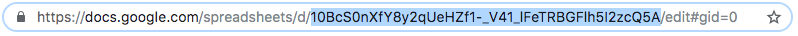

# McCustom Starter

Basic static site builder to be used on McClatchy Sinclair pages.

Built with [Parcel.js](https://parceljs.org/).

**Includes**

- `babel 7`
- `sass`
- `autoprefixer`
- `eslint`
- `nunjucks`

## Install

You can clone this repo as usual, or use [`create-clone`](https://github.com/rdmurphy/create-clone).

```sh
yarn create clone aaronalbright/mccustom-starter <newProjectName>
# or
npm init clone aaronalbright/mccustom-starter <newProjectName>
```

### Using nunjucks

The context file that gets rendered with the template is stored in `src/data/context.json`.

### To start a server at `localhost:3000`

```sh
yarn start
```

### Build a static site

```sh
yarn build
```

Builds files into `build/`

## Fetching external data

1. Create a Google Doc or Sheet.
2. Share it with McClatchy's Google service account.
3. Place the Google auth tokens file in your local home directory. (You'll get these from a Design Team member)
4. Copy the doc ID (between `d/` and `/edit` from the URL) and place it in either `config.docID` or `config.sheetID` in `package.json`



Currently, you can only work with one or the other, unless you change the output in `/utils/get-data.js`.

This feature is exclusively designed for use as the nunjucks templating context (i.e. `context.json`).

Eventually, all fetched files will be able to be placed in the `./data` folder.

### Get [AML-formatted](http://archieml.org/) Google Doc

```sh
yarn get:doc
```

### Get Google Sheet

```sh
yarn get:sheet
```

The file is saved to `src/data/context.json`.

### Fetch a Google Sheet and update an extneral file via SSH

```
yarn push:sheet
```

---

## To do

- Better handling of multiple data sources
- Option for not storing data as a nunjucks context
